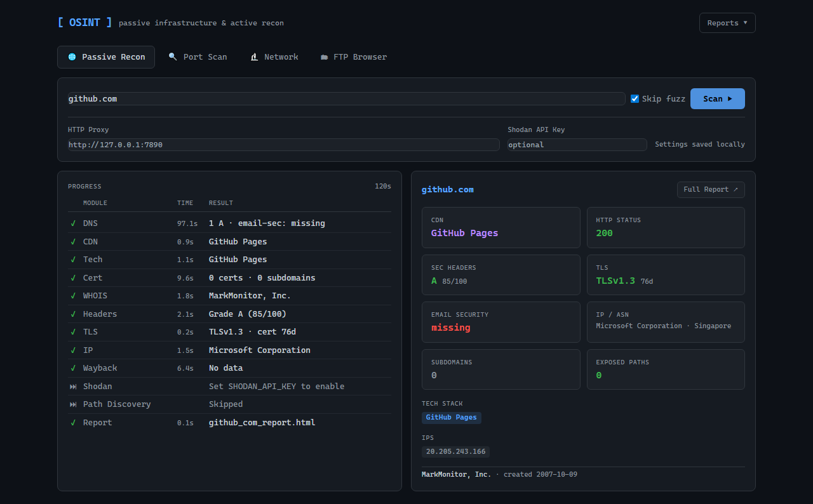

# Infra Recon

> Read this in: English · [简体中文](./README.zh-CN.md)

A passive infrastructure reconnaissance tool. Feed it a domain, and it analyzes DNS structure, CDN attribution, tech stack, email security configuration, subdomains, and exposed paths, then outputs a self-contained HTML + Markdown report.

Now ships with a **local web console** (`python app.py`) — real-time streaming progress, port scanner, network analyzer, and FTP browser, all in one UI.



Inspired by the [btc.day CDN exposure case](https://x.com/mork1e). By tracking publicly available infrastructure information, you can peel back the deployment structure layer by layer.

---

## Modules

| Module | What it does |
|--------|--------------|
| DNS | Resolves A / AAAA / MX / NS / TXT records, follows CNAME chains |
| CDN detection | Identifies Cloudflare / Fastly / CloudFront / Akamai etc. via CNAME and HTTP response headers |
| Tech fingerprinting | Identifies frameworks / CMS / languages (WordPress, Next.js, Django, etc.) via HTTP headers, HTML content, cookies |
| Email security | Queries SPF / DMARC / DKIM, scores `strong` / `partial` / `missing` |
| Certificate transparency | Queries crt.sh, discovers subdomains and SAN from historical certificates |
| Path fuzzing | Async-enumerates 80+ high-value paths, filters out SPA false positives, separates 200 (exposed) from 403 (restricted) |
| `.DS_Store` parsing | When a readable `.DS_Store` is found, automatically parses the binary and extracts the directory file list |
| Shodan | Optional: queries open ports, service banners, CVEs (requires `SHODAN_API_KEY`) |
| WHOIS | Registrar, registration date, name servers |
| Diff | Compares against a historical snapshot, surfaces new paths, subdomains, IPs, and tech-stack changes |
| Batch scan | Reads a domain list from a file, scans each one, outputs a summary table |
| HTML + MD report | Dark theme, self-contained, viewable offline |

---

## Quick start

```bash
pip install -r requirements.txt

# Full recon
python cli.py example.com

# Skip path fuzzing (faster)
python cli.py example.com --no-fuzz

# Specify report output path
python cli.py example.com -o report.html

# Save JSON snapshot for later diff
python cli.py example.com --snapshot

# Diff against an old snapshot
python cli.py example.com --diff example_com_20260101_snapshot.json

# Batch scan
python cli.py -f domains.txt

# Enable Shodan (requires API key)
export SHODAN_API_KEY=your_key_here
python cli.py example.com
```

---

## Project structure

```
osint/
├── cli.py                  # Entry: orchestrates all modules, progress display, batch scan, diff, snapshots
├── requirements.txt
├── recon/
│   ├── dns_module.py       # DNS resolution + CNAME chains + CDN hints + SPF/DMARC/DKIM
│   ├── cdn_module.py       # HTTP header fingerprinting + CDN direct URL construction
│   ├── cert_module.py      # crt.sh API + TLS direct SAN extraction (dual-path fallback)
│   ├── fuzz_module.py      # Async path enumeration + SPA filtering + .DS_Store parsing
│   ├── tech_module.py      # Tech fingerprinting (headers / HTML / cookies)
│   ├── shodan_module.py    # Shodan API integration (optional)
│   └── whois_module.py     # WHOIS lookup
└── report/
    ├── template.html.j2    # Jinja2 dark HTML template
    └── renderer.py         # Data → HTML + Markdown rendering
```

---

## Module API

```python
from recon import dns_module, cdn_module, cert_module, fuzz_module, tech_module, shodan_module

# DNS + email security
result = dns_module.run("target.com")
# → { a_records, cname_chain, cdn_hint, email_security: {spf, dmarc, dkim, score}, ... }

# CDN detection
result = cdn_module.run("target.com", dns_result=dns_result)
# → { cdn_detected, detection_method, key_headers, fastly_direct, ... }

# Tech fingerprinting
result = tech_module.run("target.com")
# → { techs: ["Nginx", "WordPress"], generator: "WordPress 6.4", details: {...} }

# Certificate transparency
result = cert_module.run("target.com")
# → { total_certs, subdomains, wildcards, issuers, ... }

# Path fuzzing (with .DS_Store auto-parsing)
result = fuzz_module.run("https://target.com")
# → { paths_tested, findings: [{ path, url, status, content_type, ds_store_files? }, ...] }

# Shodan (requires SHODAN_API_KEY env var)
result = shodan_module.run(["1.2.3.4", "5.6.7.8"])
# → { enabled, all_ports, all_vulns, results: { ip: { ports, services, vulns, geo } } }
```

---

## Report sections

- **Summary Cards**: CDN, IP count, tech stack, email-security rating, exposed paths, subdomains
- **Alerts**: Shodan CVEs, missing email security, exposed files, Fastly/CloudFront direct URLs
- **Email Security**: SPF / DMARC / DKIM per-item status + composite rating
- **CDN & Infrastructure**: detection result + key response headers
- **Technology Stack**: tech list + detection source (headers / HTML / cookies)
- **Shodan Intelligence**: open ports, service banners, CVEs, geo info (optional)
- **Path Discovery**: split into Exposed (200) / Restricted (403) / Other
- **Certificate Transparency**: subdomain list + wildcards + CA info
- **WHOIS**: registrar, validity, name servers
- **Change Detection**: diff result against a historical snapshot (optional)

---

## Notes

- Only collects publicly available information. Does not initiate any active attack.
- Path fuzzing sends HTTP requests to the target. Make sure you have permission to test the target.
- Read up on local laws and regulations before testing.

---

## Dependencies

```
dnspython    # DNS resolution
httpx        # Async HTTP client
jinja2       # HTML template rendering
rich         # Terminal progress display
python-whois # WHOIS lookup
```

## License

MIT
